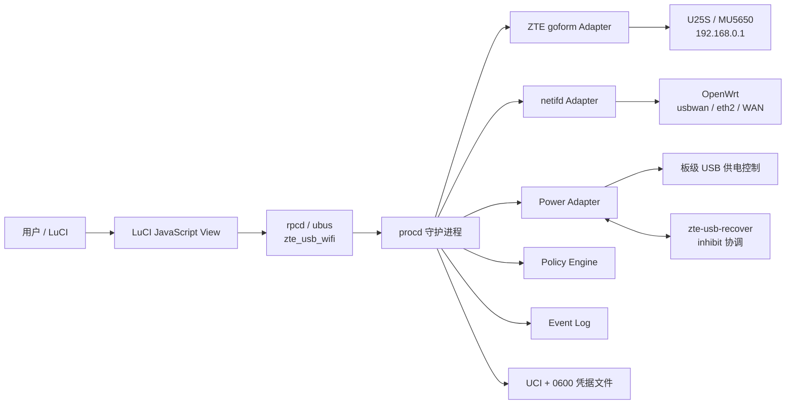
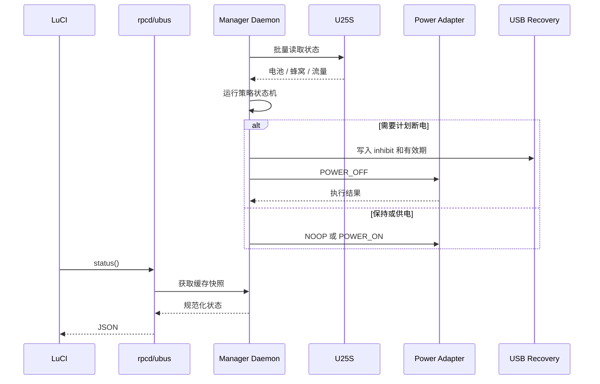

# 中兴随身 WiFi 管理工具详细设计文档

> **状态：已被新产品规格取代。** 当前产品定位和实施边界以
> [`2026-08-01-u25s-console-integration-design.md`](../superpowers/specs/2026-08-01-u25s-console-integration-design.md)
> 为准。本文保留用于追溯早期接口调研；其中电池阈值、充电日程和自动 USB
> 断电设计不得实现，因为关闭 TR3000 USB VBUS 会同时中断 U25S 数据连接。

## 1. 文档信息

| 项目 | 内容 |
|---|---|
| 产品名称 | 中兴随身 WiFi 管理 |
| 产品形态 | OpenWrt LuCI 插件 + 本地守护进程 |
| 目标设备 | 中兴 U25S（平台型号 MU5650） |
| 目标路由器 | Cudy TR3000 v1，MediaTek MT7981 |
| 目标系统 | OpenWrt 25.12.5，Linux 6.12，APK 包管理 |
| 当前连接 | U25S 通过 USB 接入 OpenWrt，逻辑接口 `usbwan`，网络设备 `eth2` |
| 设备管理地址 | `http://192.168.0.1/` |
| 文档版本 | 1.0 |
| 调研日期 | 2026-07-29 |

配套 UI 成品稿见 `zte-usb-wifi-manager-ui.html`。HTML 只表达最终产品界面，本文件承载需求、接口和工程设计。

## 2. 产品定位

本产品是一个**通过 USB 接入 OpenWrt 的中兴 U25S 设备控制台整合工具**。
它将原本位于 U25S 后台的移动网络、SIM、流量、短信、U25S Wi-Fi、客户端、
设备动作和诊断集中到一个 LuCI 功能入口中。电池仅作为设备遥测信息展示。

在 LuCI 左侧菜单中只注册一个“中兴随身 WiFi”入口。进入后，在内容区顶部使用标签页切换模块，不为每个模块额外占用左侧菜单。

## 3. 需求描述

### 3.1 背景

当前网络由 OpenWrt 路由器和中兴 U25S 随身 WiFi 组成：

- U25S 负责蜂窝网络接入、SIM、移动数据和设备电池。
- OpenWrt 负责 LAN/WLAN、DHCP、防火墙、OpenClash、LED 状态和默认出口。
- U25S 通过 USB 向 OpenWrt 提供以太网型上联，OpenWrt 将其识别为 `eth2`，并由 `usbwan` 使用 DHCP 获取地址。
- 未来互联网入口可能改为 OpenWrt 的物理 WAN 口，但仍可能保留 U25S 作为备用网络或独立管理设备。

直接使用 U25S 原生后台存在以下问题：

- 与 OpenWrt 的接口、默认路由和 USB 状态割裂。
- 无法与 OpenWrt 的 USB 故障恢复逻辑协调。
- 没有面向长期插电场景的电池养护、离岗前充电和故障保护。
- 设备状态、操作记录和错误信息无法统一查看。

### 3.2 产品目标

1. 在 LuCI 中统一展示 U25S、USB 上联和 OpenWrt 网络状态。
2. 管理移动网络、SIM、APN、流量、短信、U25S Wi-Fi 和接入设备。
3. 在安全确认后执行重新拨号、SIM 切换、设备重启等操作。
4. 展示电池状态，但不根据电量或日程改变 USB 供电。
5. 将人工 USB 电源循环严格限定为明确会中断数据的故障恢复能力。
6. 当设备 API 或守护进程异常时保留最后可信状态并清楚报告错误。
7. 不依赖 `usbwan` 必须是默认出口；切换到物理 WAN 后仍可管理 U25S。
8. 控制日志规模，不在每次轮询或代理探测时持续刷日志。

### 3.3 非目标

- 不替代 OpenWrt 的 DHCP、防火墙、端口转发、DDNS 和 LAN 客户端管理。
- 不修改 OpenClash 的节点、规则、GeoIP 更新或故障策略。
- 不改变现有 LED 的百度/谷歌可达性判定。
- 不提供修改 IMEI、射频功率、非公开锁频参数等高风险能力。
- 第一版不承诺适配所有中兴随身 WiFi；以当前 U25S/MU5650 固件为准。
- 不在网页、配置导出或日志中保存、显示设备密码、Cookie、SIM 身份信息或短信正文。

### 3.4 设计原则

- **设备专属能力集中管理**：移动网络、SIM、短信、电池和 U25S Wi-Fi 由本插件负责。
- **OpenWrt 原生能力保持原位**：常规路由功能仍由 LuCI 原生页面管理。
- **状态可解释**：每个自动动作都能看到触发原因、当前状态和下一动作。
- **危险操作二次确认**：SIM 切换、网络模式、APN、重启、关机、恢复出厂和固件更新均需确认。
- **故障安全**：无法确认时不主动断电，失败时尽可能恢复供电。
- **低资源占用**：复用 OpenWrt 现有工具，运行数据优先放在 tmpfs。

## 4. 功能模块

### 4.1 信息架构

| 标签页 | 核心内容 | 主要数据来源 |
|---|---|---|
| 总览 | 在线状态、默认出口、电量、USB 供电、策略模式、快捷动作、下一日程 | ZTE API、netifd、守护进程 |
| 移动网络 | 网络制式、运营商、信号、连接模式、漫游、SIM、APN、重新拨号 | ZTE goform |
| Wi-Fi 与设备 | U25S 2.4/5 GHz 开关、主/访客 SSID、WPS、客户端、接入控制 | ZTE goform |
| 流量 | 实时速率、本次连接、本月用量、套餐上限、清零日、提醒阈值 | ZTE goform、netifd |
| 短信 | 收件箱、已发送、草稿、发送、删除、已读状态 | ZTE goform |
| 电池与供电 | 电量、充电状态、温度级别、维护阈值、USB 控制、故障保护 | ZTE API、Power Adapter |
| 充电日程 | 工作日、普通/加班离岗时间、提前量、今日覆盖、立即充满 | UCI、策略引擎 |
| 设备 | 型号、固件、设备连接、能力检测、重启/关机、备份入口 | ZTE API、本地配置 |
| 系统与诊断 | 守护进程、USB 恢复协调、接口诊断、网络工具、组件边界 | procd、ubus、netifd |
| 日志 | 状态变化、人工操作、异常、日志级别、清理 | 守护进程 |

### 4.2 总览

- 显示 U25S 是否在线、设备地址和当前移动网络制式。
- 显示 `usbwan`、`eth2`、网关和当前默认出口。
- 显示电量、充电状态、USB 供电状态和当前策略状态。
- 显示下一次自动动作及触发时间。
- 提供“今天加班”“立即充满”“暂停自动控制”“立即执行策略”等快捷动作。
- 任何手动动作均写入事件日志。

### 4.3 移动网络与 SIM

- 展示注册状态、运营商、网络制式、信号格和 RSRP。
- 配置自动/手动连接、数据漫游、RedCap/4G 网络偏好。
- 展示当前活动 SIM 卡槽；支持经过确认的 SIM 切换。
- 双卡区域分别显示 SIM 1、SIM 2 的就绪、运营商、注册和数据连接状态。
- 提供“切换到此卡”操作；当前号卡按钮禁用，避免重复提交。
- 管理 APN 模式、当前 APN 和配置档。
- 提供重新拨号、重新扫描运营商等操作。
- SIM 切换必须二次确认，并执行“提交切换 → SIM 就绪 → 蜂窝注册 → PPP 恢复”的完整状态检查；APN 和网络模式修改也必须在操作后验证网络恢复。

### 4.4 U25S Wi-Fi 与客户端

- 支持关闭、仅 2.4 GHz、仅 5 GHz。
- 管理主 SSID、访客 SSID、密码、加密方式和 WPS。
- 展示连接到 U25S 自身 Wi-Fi 的客户端。
- 支持接入控制和离线设备历史。
- 明确区分 U25S 客户端和 OpenWrt LAN/WLAN 客户端，后者仍由 LuCI 原生页面管理。

### 4.5 流量

- 展示实时上下行、本次连接用量和连接时长。
- 展示设备侧月度流量。
- 配置套餐容量、每月清零日期和提醒百分比。
- 提供清零设备统计操作，并要求二次确认。
- 设备统计仅用于参考，不作为运营商计费凭证。

### 4.6 短信

- 展示收件箱、已发送和草稿数量。
- 支持读取、发送、保存、删除和标记已读。
- 短信正文只在用户主动打开时加载。
- 系统日志只记录“发送成功/失败”“删除成功/失败”等事件，不记录号码和正文。

### 4.7 电池、供电与日程

- 读取电池是否存在、电量、是否充电、电压/状态值和温度级别。
- 使用低/高阈值构成滞回区间，避免临界电量附近频繁开关。
- 支持普通工作日、加班日、提前充电时间和今日一次性覆盖。
- 支持手动立即充满。
- U25S 固件未发现可靠的“停止充电百分比”接口，因此停止充电通过 OpenWrt 板级 USB 供电控制实现。
- 当设备状态不可读或控制失败时进入 `FAIL_SAFE_ON`，尽可能保持 USB 供电。

### 4.8 系统与诊断

- 显示后端守护进程、ZTE 会话、Power Adapter 和 `zte-usb-recover` 状态。
- 提供设备能力检测和接口诊断。
- 可调用 U25S 自带的网络诊断能力，但不复制 OpenWrt 已有的通用路由配置。
- FOTA/OTA 第一阶段只展示版本和打开原生后台入口，不自动更新。

## 5. 接口调研

### 5.1 实机信息

以下结果来自对当前设备后台的只读调研：

| 项目 | 已确认结果 |
|---|---|
| 市场型号 | ZTE U25S |
| 平台型号 | MU5650 |
| 固件 | `BD_CNMU5650V1.0.0B13` |
| 产品类型 | UFI / RedCap Mobile Hotspot |
| 当前网络 | `NR5G-SA` |
| 当前运营商 | 中国移动 |
| 信号字段 | `Z5g_rsrp`，调研时为 -68 dBm |
| 数据连接 | PPP IPv4、IPv6 已连接 |
| 双 SIM | 支持，调研时活动卡槽为 SIM 2 |
| U25S Wi-Fi | 支持关闭、2.4 GHz、5 GHz |
| 短信 | 菜单和前端能力配置均确认支持 |
| 电池 | 电池存在、电量和充电状态可读 |

文档不记录设备密码、Cookie、IMEI、IMSI、ICCID、手机号或短信内容。

### 5.2 原生后台功能

实机菜单确认包含：

- 首页。
- 移动网络。
- Wi-Fi：主 SSID、访客 SSID、WPS、高级设置。
- 接入设备：在线设备、Wi-Fi 过滤、离线设备。
- 流量管理。
- 路由器：DHCP、MAC-IP 绑定、DDNS、网络工具。
- 短信。
- 安全：端口过滤、端口映射、端口转发、URL 过滤、系统安全。
- 更新管理。
- 系统：设备信息、诊断、登录密码、Wi-Fi 休眠、省电、屏幕 Wi-Fi、SNTP、备份恢复、快速启动、系统设置、开发者选项等。
- 系统动作：关机、重启、定时重启、恢复出厂、设备日志。

插件只优先复用 U25S 独有功能。DHCP、防火墙、DDNS、端口转发等与 OpenWrt 重叠的能力不进入主流程，必要时只提供“打开设备后台”入口。

### 5.3 认证协议

U25S 使用 ZTE goform 接口。已确认登录流程：

1. 获取登录挑战：

   ```http
   GET /goform/goform_get_cmd_process?cmd=LD&isTest=false
   ```

2. 对用户密码执行 SHA-256，得到固件函数返回的大写十六进制摘要。
3. 将大写的第一轮摘要与 `LD` 拼接，再执行一次 SHA-256。
4. 将最终摘要同样编码为大写十六进制。
5. 提交登录：

   ```http
   POST /goform/goform_set_cmd_process
   Content-Type: application/x-www-form-urlencoded

   goformId=LOGIN&password=<UPPERCASE_SHA256>
   ```

6. 后续请求复用 HTTP 会话 Cookie。密码、摘要和 Cookie 均不得写入日志。

注意：读取 `LD` 时不添加 `multi_data=1`。通用多字段读取才使用该参数。

### 5.4 通用读取接口

```http
GET /goform/goform_get_cmd_process?cmd=<field1,field2,...>&multi_data=1&isTest=false
Referer: http://192.168.0.1/
X-Requested-With: XMLHttpRequest
```

后端适配器负责：

- 合并字段，减少请求次数。
- 处理 Cookie 过期并最多自动重新登录一次。
- 校验 HTTP 状态、JSON 结构和字段类型。
- 将厂商字段转换成稳定的内部模型。
- 对连续错误使用指数退避。

### 5.5 已验证读取字段

| 能力 | 字段 |
|---|---|
| 设备状态 | `mc_modem_main_state` |
| 网络制式 | `network_type` |
| 信号格 | `network_signalbar` |
| 运营商 | `network_provider_fullname` |
| 5G RSRP | `Z5g_rsrp` |
| PPP 状态 | `ppp_status` |
| 活动 SIM | `simcard_active_slot_temp` |
| SIM 类型 | `usim_esim_type` |
| 电池存在 | `battery_exist` |
| 电量百分比 | `battery_vol_percent` |
| 充电状态 | `battery_charging` |
| 电池值 | `battery_value`、`battery_pers` |
| 温度级别 | `battery_temperature_level` |
| 实时流量 | `flux_realtime_*` |
| 月度流量 | `flux_monthly_*`、`flux_data_volume_*` |
| 客户端 | `station_list` |
| 短信数量 | `sms_data_total` |

带 `*` 的字段表示同一前缀下包含多个计数项，具体映射应固化为适配器 fixture 并测试。

### 5.6 写接口和操作标识

写操作统一提交到：

```http
POST /goform/goform_set_cmd_process
Content-Type: application/x-www-form-urlencoded

goformId=<ACTION>&...
```

| 功能 | 已发现的 `goformId` / 操作 |
|---|---|
| 登录/退出 | `LOGIN`、`LOGOUT` |
| SIM 切换 | `SIM_SWITCH_SIMCARD`，参数 `card_index` |
| 连接模式 | `SET_CONNECTION_MODE` |
| 网络偏好 | `SET_BEARER_PREFERENCE` |
| 扫描/选择网络 | `SCAN_NETWORK`、`SET_NETWORK` |
| APN | `APN_PROC`、`APN_PROC_EX` |
| 流量计划 | `DATA_LIMIT_SETTING` |
| 流量清零 | `RESET_DATA_COUNTER` |
| Wi-Fi 模块/频段 | `switchWiFiModule`、`switchWiFiChip` |
| SSID | `setAccessPointInfo` |
| WPS | `WIFI_WPS_SET` |
| Wi-Fi 高级设置 | `WIFI_ADVANCE_SET` |
| 接入控制 | `setDeviceAccessControlList`、`WIFI_STA_CONTROL` |
| 发送/保存短信 | `SEND_SMS`、`SAVE_SMS` |
| 删除短信 | `DELETE_SMS`、`ALL_DELETE_SMS` |
| 标记已读 | `SET_MSG_READ` |
| 重启/关机 | `REBOOT_DEVICE`、`SHUTDOWN_DEVICE` |
| 恢复出厂 | `RESTORE_FACTORY_SETTINGS` |

这些名称来自当前固件前端和实机功能调研。正式实现每个写操作前仍需完成一次“参数名、编码、返回值、副作用”的受控实机验证；未通过验证的动作不得显示为可用按钮。

#### 号卡手动切换专项结论

当前 U25S 固件的 `service.js` 已包含以下手动切换请求构造器：

```text
goformId=SIM_SWITCH_SIMCARD
card_index=<目标卡槽>
```

当前活动卡槽可通过 `simcard_active_slot_temp` 读取。固件通用代码中虽然残留其他双卡相关符号，但当前原厂管理页面没有开放对应功能，因此本产品不展示也不承诺这些能力。

实现时必须先完成一次受控卡槽映射测试，确认此固件的 `card_index` 是 `0/1` 还是 `1/2` 语义。映射确认后固化在 `zte_u25s` 适配器内，不允许 LuCI 前端直接提交未经转换的数值。

切换流程：

1. 读取并记录当前 `simcard_active_slot_temp`、SIM 状态、注册状态和 PPP 状态。
2. 用户二次确认后提交目标卡槽。
3. 将操作状态置为 `SWITCHING_SIM`，临时禁止重复切换、APN 修改和网络模式修改。
4. 等待活动卡槽变为目标值。
5. 等待新卡 SIM 就绪和蜂窝网络注册。
6. 等待 PPP IPv4/IPv6 至少一个恢复，或按配置主动重新拨号一次。
7. 成功后刷新运营商、信号、APN 和流量数据。
8. 超时则停止自动重试并显示诊断结果；不得在两个卡槽之间循环切换。

号卡切换可能导致数十秒移动数据中断。如果当时默认出口是 `usbwan`，LuCI 页面可能暂时无法访问外网，但路由器本地管理地址仍应可用。若默认出口为物理 WAN，切卡不应影响主网络。

### 5.7 未确认或不采用的接口

- 未发现可靠的电池充电上限或“停止充电”厂商接口。
- FOTA/OTA 存在，但第一阶段不自动触发。
- 设备诊断存在 `DIAG_URL`、`DIAG_CHECK` 和 traceroute 相关能力，参数需在实现阶段验证。
- 不实现修改 IMEI、射频隐藏参数或其他规避设备限制的接口。

## 6. 实现方案

### 6.1 软件包拆分

建议拆成两个 APK 包：

1. `zte-usb-wifi-manager`
   - 设备适配器。
   - 策略引擎。
   - Power Adapter。
   - procd 守护进程。
   - rpcd/ubus 服务。
   - UCI 默认配置。

2. `luci-app-zte-usb-wifi-manager`
   - LuCI 菜单。
   - 10 个内容标签页。
   - rpcd ACL。
   - 中文文案和前端资源。

卸载 LuCI 包不影响后端运行；卸载后端前必须停止守护进程并恢复 USB 供电。

### 6.2 技术选型

- LuCI 使用现代 JavaScript View，不引入 React/Vue。
- 本地通信使用 `rpc.declare()` → rpcd/ubus。
- 持久配置使用 UCI。
- 守护进程由 procd 管理。
- HTTP 请求使用 `curl`。
- JSON 解析优先使用 `jsonfilter` 或 `jshn`。
- 网络状态使用 `ubus call network.interface.* status` 和 netifd。
- 瞬时状态、锁和日志位于 `/var/run`、`/tmp`。
- 不为单一功能引入 Python、Node.js 或大型运行时。

### 6.3 前端实现

- 菜单路径：`服务 → 中兴随身 WiFi`。
- 模块切换保持在内容区顶部。
- 首页请求聚合状态，其他标签页进入时按需加载。
- 状态刷新默认 5 秒；实时速率可使用 1 秒刷新，但标签页失焦时停止。
- 保存动作显示明确的进行中、成功和失败状态。
- 危险操作使用确认对话框，展示动作影响和恢复方式。
- 密码字段为空表示“保留现有凭据”，永不回填。
- 短信正文仅在用户点开具体消息时请求。

### 6.4 后端实现

守护进程每 30 秒执行：

1. 检查系统时间和运行配置。
2. 读取 U25S 电池、移动网络和会话状态。
3. 读取 OpenWrt 接口和默认路由。
4. 将电量、时间、手动覆盖和当前供电交给策略引擎。
5. 仅在期望供电状态变化时调用 Power Adapter。
6. 计划断电前写入 recovery inhibit。
7. 验证动作结果，更新 ubus 状态。
8. 只在状态变化、人工操作和异常时写日志。

UI 的主动刷新可以触发只读快照，但不能绕过守护进程直接执行 shell。

号卡切换、APN 修改和网络制式切换由独立的设备动作队列串行执行。动作进行期间策略引擎仍可监控电池，但不能发起会让 U25S 断电的操作；待移动网络动作完成或超时后再恢复正常供电决策。

### 6.5 与现有系统协调

- **OpenClash**：不读取或修改其配置；插件请求按路由器现有规则正常经过。
- **LED 服务**：不改变百度/谷歌检测及白/黄/红显示，只可读取结果用于诊断摘要。
- **系统更新冻结**：不修改软件、主题、OpenClash 的现有更新策略。
- **物理 WAN**：默认出口改为 WAN 时，总览跟随显示；U25S 管理和电池策略继续工作。
- **USB 恢复服务**：计划断电期间必须抑制 xHCI 重置，计划结束或超时后自动解除。

## 7. 架构设计

### 7.1 组件图



### 7.2 组件职责

| 组件 | 职责 |
|---|---|
| LuCI View | 展示、表单校验、确认对话框；不直接调用 shell |
| rpcd/ubus | ACL、参数校验、状态聚合、命令入口 |
| 守护进程 | 轮询、状态缓存、动作串行化、日志、故障恢复 |
| ZTE Adapter | 登录、Cookie、字段映射、厂商动作 |
| netifd Adapter | OpenWrt 接口、地址、网关、默认路由 |
| Power Adapter | 抽象板级脚本、GPIO character device 或自定义后端 |
| Policy Engine | 纯输入到输出的确定性状态机 |
| recovery 协调 | 防止计划断电触发 xHCI 重置循环 |

### 7.3 数据流



## 8. 配置与数据模型

### 8.1 UCI 配置

```uci
config core 'main'
        option enabled '1'
        option poll_interval '30'
        option failure_threshold '3'
        option fail_safe_power 'on'

config device 'zte'
        option host '192.168.0.1'
        option interface 'usbwan'
        option netdev 'eth2'
        option adapter 'zte_u25s'
        option credential_file '/etc/zte-usb-wifi-manager/credentials'

config battery 'policy'
        option enabled '1'
        option low_percent '70'
        option high_percent '100'

config schedule 'work'
        option timezone 'Asia/Shanghai'
        option weekdays '1 2 3 4 5'
        option normal_departure '18:00'
        option overtime_departure '21:00'
        option lead_minutes '90'

config power 'usb'
        option backend 'auto'
        option target ''

config integration 'recovery'
        option inhibit_file '/var/run/zte-usb-wifi-manager/inhibit-recovery'
```

约束：

- `30 ≤ low_percent < high_percent ≤ 100`。
- 轮询间隔不低于 10 秒。
- `host` 只接受 IP 或合法主机名，不接受 URL 参数片段。
- `interface` 和 `netdev` 必须经过白名单格式校验。
- 凭据文件权限必须为 `0600`，UCI 只存路径。

### 8.2 运行状态

以下数据保存在 `/var/run/zte-usb-wifi-manager/`，不频繁写入闪存：

- 当前状态机状态。
- 最近一次成功轮询时间。
- 连续失败次数。
- 当前/期望 USB 供电状态。
- `today_overtime`、`skip_today`、`manual_full`、`paused`。
- recovery inhibit 的原因和到期时间。
- 最近错误摘要。

## 9. ubus 接口

对象名：`zte_usb_wifi`

| 方法 | 参数 | 返回/行为 |
|---|---|---|
| `status` | 无 | 聚合设备、网络、电池、策略、下一动作和错误 |
| `refresh` | 无 | 立即执行一次只读刷新 |
| `run_policy` | 无 | 刷新状态并运行一次策略 |
| `set_override` | `type`、`enabled` | 设置加班、立即充满、暂停或今日跳过 |
| `set_power` | `on`、`reason` | 手动设置 USB 供电 |
| `probe_device` | 可选 `host` | 验证登录和字段映射，不改变设备配置 |
| `probe_power` | 可选 `backend` | 检测供电后端 |
| `cellular_action` | `action`、参数 | 串行执行已验证的移动网络动作 |
| `wifi_action` | `action`、参数 | 执行 U25S Wi-Fi 动作 |
| `sms_list` | 文件夹、分页 | 返回短信元数据 |
| `sms_get` | 消息 ID | 按需读取正文 |
| `sms_action` | 发送/保存/删除/已读 | 执行短信动作 |
| `device_action` | `action`、`confirm` | 排队执行经能力门控的重启或关机；未校准时拒绝 |
| `logs` | `level`、`limit` | 返回脱敏事件日志 |

每个方法都必须配置 rpcd ACL。危险写操作还需要服务端再次验证参数和当前状态，不能只依赖前端确认。

`cellular_action` 的号卡切换请求示例：

```json
{
  "action": "switch_sim",
  "target": "sim1"
}
```

ubus 只接受语义值 `sim1` 或 `sim2`。rpcd 将其交给设备适配器转换为固件所需的 `card_index`，返回 `operation_id`；LuCI 通过 `status` 查询切换阶段和最终结果。

## 10. 电池策略状态机

### 10.1 状态

| 状态 | 含义 | 期望供电 |
|---|---|---|
| `DISABLED` | 自动控制关闭，仅监控 | 保持现状 |
| `MAINTAIN_CHARGING` | 电量低于下限，维护充电 | ON |
| `MAINTAIN_BATTERY` | 达到上限，使用内置电池 | OFF |
| `PRE_DEPARTURE` | 进入离岗前窗口 | ON |
| `MANUAL_FULL` | 用户要求立即充满 | ON |
| `FAIL_SAFE_ON` | 状态不可读或控制失败 | ON |

### 10.2 优先级

从高到低：

1. 故障保护。
2. 手动立即充满。
3. 离岗前强制充电。
4. 电量阈值维护。
5. 自动控制关闭时保持现状。

### 10.3 关键转换

| 条件 | 目标状态 | 动作 |
|---|---|---|
| API/Power Adapter 连续失败达到阈值 | `FAIL_SAFE_ON` | 尝试 USB ON，退避重试 |
| 用户点击立即充满 | `MANUAL_FULL` | USB ON |
| 进入离岗前窗口 | `PRE_DEPARTURE` | USB ON |
| 电量 ≤ low | `MAINTAIN_CHARGING` | USB ON |
| 电量 ≥ high | `MAINTAIN_BATTERY` | 写 inhibit，再 USB OFF |
| low < 电量 < high | 保持当前维护状态 | NOOP |
| 用户关闭自动控制 | `DISABLED` | 不改变当前供电 |

系统时间未同步时，禁用日程转换，但电量阈值维护继续运行。

## 11. 可靠性、安全与日志

### 11.1 错误处理

- 单次读取失败：保留最后可信状态，增加失败计数。
- 达到失败阈值：进入 `FAIL_SAFE_ON`。
- Cookie 过期：重新登录一次；仍失败则进入退避。
- 写操作超时：不盲目重试危险动作，先读取状态确认。
- Power Adapter 失败：停止频繁开关，记录错误并尝试保持/恢复供电。
- recovery inhibit 必须有到期时间；守护进程崩溃后也不会永久屏蔽恢复服务。
- 所有外部动作串行化，防止 UI 与自动策略同时控制供电或拨号。

### 11.2 安全

- 凭据文件 `0600`，不进入普通 UCI 备份导出。
- 日志禁止包含密码、哈希、Cookie、手机号、SIM 标识和短信正文。
- rpcd ACL 默认只允许已登录的 LuCI 管理员。
- 所有 shell 参数使用固定枚举或严格校验，不拼接原始用户输入。
- 恢复出厂、关机和固件更新默认不开放自动化调用。
- 前端隐藏按钮不能代替后端能力控制；未验证能力由后端返回 `unsupported`。

### 11.3 日志策略

- 只记录服务启动/退出、状态转换、人工操作、恢复动作和异常。
- 成功轮询不逐次写日志。
- 默认级别 `info`，诊断时可临时切换 `debug`。
- 日志位于 tmpfs。
- 单文件上限 512 KiB，保留 2 份。
- UI 默认展示最近 200 条，支持级别过滤和清空显示。

## 12. 包结构

```text
zte-usb-wifi-manager/
├── Makefile
├── files/
│   ├── etc/config/zte-usb-wifi-manager
│   ├── etc/init.d/zte-usb-wifi-manager
│   ├── etc/uci-defaults/90-zte-usb-wifi-manager
│   ├── usr/libexec/rpcd/zte-usb-wifi
│   ├── usr/sbin/zte-usb-wifi-managerd
│   └── usr/lib/zte-usb-wifi-manager/
│       ├── adapter-zte-u25s-metadata.sh
│       ├── adapter-zte-u25s.sh
│       ├── netifd-adapter.sh
│       ├── power-adapter.sh
│       ├── policy.sh
│       ├── session.sh
│       └── log.sh
└── tests/
    ├── fixtures/
    ├── test-adapter.sh
    ├── test-policy.sh
    └── test-validation.sh

luci-app-zte-usb-wifi-manager/
├── Makefile
└── root/
    ├── usr/share/luci/menu.d/luci-app-zte-usb-wifi-manager.json
    ├── usr/share/rpcd/acl.d/luci-app-zte-usb-wifi-manager.json
    └── www/luci-static/resources/view/zte-usb-wifi/
        ├── index.js
        ├── overview.js
        ├── network.js
        ├── wifi.js
        ├── traffic.js
        ├── sms.js
        ├── battery.js
        ├── schedule.js
        ├── device.js
        ├── diagnostics.js
        └── logs.js
```

## 13. 测试与验收

### 13.1 自动化测试

- 认证摘要计算使用固定向量测试。
- ZTE Adapter 使用脱敏响应 fixture 测试正常、缺字段、超时、会话过期和异常 JSON。
- 状态机使用表驱动测试覆盖所有状态转换。
- 边界值覆盖 `low-1`、`low`、`low+1`、`high-1`、`high`、`100`。
- 测试普通日、加班日、跨午夜、Asia/Shanghai 和时间未同步。
- Power Adapter 测试 ON/OFF/NOOP 幂等性和失败处理。
- 测试 UCI 校验、ubus ACL 和日志敏感信息扫描。
- LuCI 测试所有标签页、移动端布局、表单错误和危险确认。

### 13.2 实机验收

- LuCI 能稳定显示 U25S 的真实网络、电池、流量和设备状态。
- 移动网络、Wi-Fi、流量和短信的已开放写操作均验证成功与失败返回。
- SIM 1 → SIM 2 和 SIM 2 → SIM 1 均可完成卡槽、注册与 PPP 恢复验证。
- 切卡超时不会重复切换，也不会与 APN、网络模式或 USB 断电动作并发。
- 低电量开启 USB，高电量关闭 USB，阈值附近不抖动。
- 今天加班和立即充满能正确覆盖普通策略。
- 计划断电期间 `zte-usb-recover` 不重置 xHCI。
- API 失效后最终恢复 USB 供电，并显示明确错误。
- 默认出口切换到物理 WAN 后，插件仍能管理 U25S。
- 连续运行 72 小时无进程泄漏、日志膨胀和高频闪存写入。
- 不改变 OpenClash、LED、主题、更新冻结、LAN 和 WAN 配置。

### 13.3 完成定义

第一版完成必须同时满足：

1. 所有首版模块有真实数据源，不以静态示例冒充设备状态。
2. 所有显示为“可用”的写操作已在当前固件实机验证。
3. 未验证能力明确返回“不支持”，不显示可执行按钮。
4. 故障保护、恢复服务协调和卸载恢复供电通过实机测试。
5. 安全与日志检查通过，交付物不包含任何用户密码或设备唯一身份信息。

## 14. 分阶段交付

### 阶段 1：只读管理

- 完成登录、会话和批量读取。
- 完成总览、移动网络、流量、电池、设备和诊断状态。
- 完成 netifd 与默认出口集成。

### 阶段 2：安全写操作

- 完成双卡切换、APN、连接模式、U25S Wi-Fi、流量计划和短信。
- 为危险操作增加确认、串行化和操作后验证。

### 阶段 3：设备与系统操作

- 完成短信、设备设置、诊断和系统日志接口。
- 完成重启、关机等中断性动作的确认、串行执行和状态回读。
- 仅在备用硬件验证后研究人工 USB 电源循环；不得由电量或日程触发。

### 阶段 4：稳定性与打包

- 完成 72 小时稳定性测试、日志轮转和升级/卸载测试。
- 构建 OpenWrt APK 包。
- 冻结首版已验证能力矩阵。

## 15. 实现阶段必须完成的探测

当前仍有两类问题不能仅凭设计文档假定：

1. **TR3000 v1 的真实 USB 供电控制入口**  
   需要在当前内核和设备树上确认是板级脚本、GPIO character device、USB 控制器授权还是其他机制，并验证断电/恢复不会影响路由器其他接口。

2. **写接口的精确参数和副作用**  
   双卡切换已确认使用 `SIM_SWITCH_SIMCARD + card_index`，仍需通过一次受控切换确定 SIM 1/SIM 2 的数值映射及超时行为。APN、Wi-Fi、短信和系统动作的参数、编码、返回值及失败行为也必须逐项验证。验证前只实现对应的只读状态。

这两项属于实现前置探测，不影响 UI 和总体架构，但会决定 Power Adapter 与具体写操作的最终代码。
